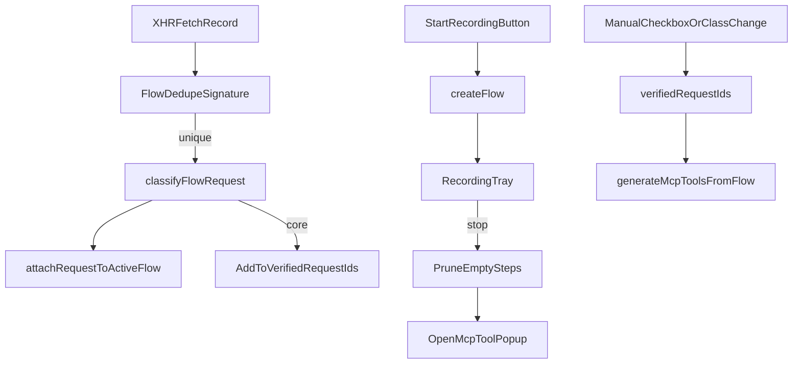

# Flow 录制体验修复计划

## 目标行为

- 勾选请求列表或 Flow 中“已验证”时，列表保持当前滚动位置，不再因为整块重渲染跳到顶部。
- 录制期间过滤重复请求，避免同一步骤下出现同方法、同路径模板、同参数结构的重复接口。
- Flow 列表只展示有归属请求的步骤；仅点击、输入但没有触发接口的空步骤不进入可见列表，也不参与后续 MCP 生成。
- 点击“开始录制”后主弹窗收起，显示一个小型录制托盘，托盘只保留“正在录制 / 结束录制 / 打开面板”的必要操作；点击托盘“结束录制”后自动打开 MCP 工具生成/查看弹窗。
- 自动勾选核心请求：`classifyFlowRequest(record) === 'core'` 的请求自动加入 `flow.verifiedRequestIds`，后续“已验证生成 MCP”可直接使用；人工取消仍然优先。

## 关键改动

- `[extension/content/core.js](extension/content/core.js)`
  - 扩展录制期去重逻辑：在 `attachRequestToActiveFlow(record)` 前先计算 Flow 级签名，重复时不进入 `state.requestRecords` 或不挂到 Flow step。
  - 调整签名策略：保留 method、路径模板、稳定 query/body 指纹，过滤常见波动参数如时间戳、随机数、分页轮询 token 等，降低截图里重复 GET 列表刷屏的问题。
  - 在分类为 `core` 时自动维护 `verifiedRequestIds`，但不覆盖用户手动改成 `support/noise/unknown` 后的选择。
  - 录制结束或渲染前清理没有 `requestIds` 的临时步骤，避免“该步骤暂无归属请求”占据列表。

- `[extension/content/ui-core.js](extension/content/ui-core.js)`
  - 在 `refreshRequestList()` 前后保存并恢复 `.ai-req-request-list` 的 `scrollTop`，用于修复普通请求列表勾选跳顶。
  - 在 `refreshFlowWorkbench()` 或 Flow checkbox change 前后保存并恢复 `.ai-req-flow-steps` 的 `scrollTop`，用于修复 Flow 页“已验证”勾选跳顶。
  - 把 Flow 分类 select 的变更和“已验证”checkbox 的变更抽成小工具函数，让“改为核心自动勾选 / 改成噪音自动取消验证”行为一致。
  - 开始录制后调用“收起主面板并显示录制托盘”的 UI 状态切换；结束录制时停止录制、清理空步骤、打开 Flow/MCP 生成入口，并恢复普通悬浮入口状态。

- `[extension/content/state.js](extension/content/state.js)`
  - 增加轻量 UI 状态，例如 `recordingTray` 或复用 `flowRecording` 记录托盘显示所需信息。
  - 可选增加 `flow.manualVerificationOverrides`，用于区分自动勾选和用户手动取消，避免后台新刷新时又把用户取消的核心请求重新勾回。

- `[extension/content/content.css](extension/content/content.css)`
  - 新增录制托盘样式：固定悬浮、小尺寸、明显录制状态、结束按钮，保持现有深色风格。
  - 给悬浮球/主面板增加录制态 class，避免主面板收起后用户不知道仍在录制。
  - 给结束录制后的工具弹窗/生成入口保留清晰的主操作按钮样式。

## 数据流

## 验收

- 在 Flow 页中滚动到中下部，勾选“已验证”或切换分类后，滚动位置保持稳定。
- 点击开始录制后主弹窗隐藏，只显示小托盘；点击托盘“结束录制”能停止录制，并自动打开 MCP 工具生成/查看弹窗。
- 同一页面操作产生重复列表接口时，Flow 中只保留一条代表性请求。
- Flow 页面不展示“0 请求”的空步骤。
- 核心请求默认已验证，生成 MCP 时无需再手动逐个勾选；用户取消勾选后不会被自动恢复。